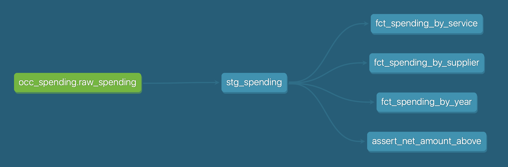

# local_gov_spending

This project demonstrates how to ingest, load, and analyse local government spending data. It uses data which is shared in line with the UK government's [Local Government Transparency Code](https://www.gov.uk/government/publications/local-government-transparency-code-2015/local-government-transparency-code-2015). This stipulates that all expenditure exceeding £500 must be published.

This data pipeline downloads Oxfordshire County Council's monthly transparency spending data (transactions over £500, published as open Excel sheets), loads it into DuckDB, and uses dbt to model it into analytical layers.

To reengineer this for use with another local authority's data set, the following would need to be considered:
- extraction logic
- column names in stg_spending.sql if the structure of the data differs 

## Project structure

```
local_gov_spending/
├── data/          # Raw .xlsx downloaded from OCC (gitignored)
├── ingest/        # Python ingestion scripts
│   ├── ingest.py  # Scrapes OCC website and downloads .xlsx files
│   └── load.py    # Loads .xlsx files into DuckDB
└── transform/     # dbt project
    ├── models/
    │   ├── staging/   # Light cleaning on raw data, one model per source
    │   └── marts/     # Analytical models (by supplier, category, department)
    ├── tests/         # Data quality tests
    └── dbt_project.yml
```

## Architecture

This project demonstrates a layered data modelling approach, sometimes called staging/marts or the medallion architecture (bronze, silver, and gold layers).

Data flows through three discrete layers, with each adopting a single responsibility:

- Raw — the source data, unmodified
- Staging — the cleaned data with renaming, casting, and standardisation applied
- Marts — business logic and aggregations, answering specific questions

The benefits of this approach include:

- Debugging — each layer is independently queryable, so isolating problems is easier
- Contained changes — if the source data changes, then only staging needs to be adjusted. Everything built on top of this remains the same
- Self-documenting — understanding the data's provenance and the transformations that have been applied to it can be easily understood



## Marts

- **fct_spending_by_service** — annual data for the total spend of each service
- **fct_spending_by_supplier** — annual data for the total spend according to supplier
- **fct_spending_by_year** — annual data for total spend by the local authority

## Setup

1. Create and activate a virtual environment:
   ```
   python3 -m venv .venv
   source .venv/bin/activate
   ```

2. Install dependencies:
   ```
   pip install -r requirements.txt
   ```

3. Verify dbt can connect:
   ```
   cd transform
   dbt debug
   ```

## Usage

Download the .xlsx files from OCC:
```
python ingest/ingest.py
```

Load them into DuckDB:
```
python ingest/load.py
```

Then run dbt to build the models:
```
cd transform
dbt run
```
